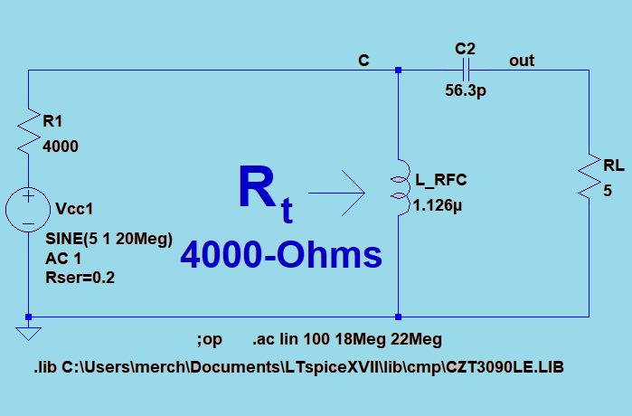
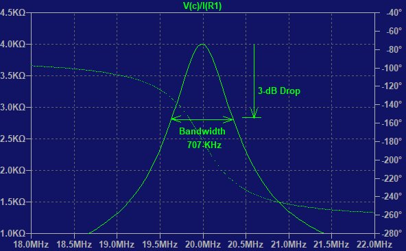

<script type="text/x-mathjax-config">
  MathJax.Hub.Config({ TeX: { equationNumbers: {autoNumber: "all"} } });
</script>

```{r getstylefile, echo=FALSE}

# options(rstudio.markdownToHTML = 
#   function(inputFile, outputFile) {      
#     require(markdown)
#     markdownToHTML(inputFile, outputFile, stylesheet='custom.css')   
#   }
# ) 

# require(knitr) 
# options(markdown.HTML.stylesheet = "custom.css")
# knit2html("index.Rmd", output = "index.html") 

```

<style> custsty {
  /*background-image:url(C:/path/mypng.png);*/ 
  background-repeat: no-repeat;
  background-position: center center;
  background-size: cover;
}


.boxText {
     font-size:0.9em;

}
    
table {
    border-collapse: collapse;
    width: 980px;
    height: 400px;
    /*background-color: #9999FF;*/
    background-image: none;
    cell-spacing: 0px;
    padding-left: 0px;
    padding-right: 75px;
    padding-top: 0px;
    padding-bottom: 0px;
    border: 0px solid #BBBBFF;
}

th {
    font-color:#FF0000;
    padding-left: 0px;
    padding-right: 0px;
    padding-top: 0px;
    padding-bottom: 0px;
    background-color: #00FFFF;
    cell-spacing: 0px;
    border: 0px solid #FFFFFF;
    margin: 0px;
    width: 480px;
    height: 20px;
}

td {
    padding-left: 0px;
    padding-right: 0px;
    padding-top: 0px;
    padding-bottom: 0px;
    cell-spacing: 0px;
    border: 0px solid #000000;
    margin: 0px;
    width: 480px;
    height: 20px;
}

body {
  background-color: #EEEEEE;
}

slide:not(.segue)  h2{
 font-family: "Open Sans Condensed";
 font-weight: 700;
 color: #449944;
 /*background-color: #00FFFF; background of S3 */
}

h3 {
    font-family: "Open Sans Condensed";
    font-weight: 90;
    font-size:32px;
    LINE-HEIGHT:65px;
    color: #449944;
    padding-top: 14px;
    padding-bottom: 5px;

}

h4 {
    LINE-HEIGHT:40px;
    color: #101010;
    padding-top: 5px;
}

h5 {
    LINE-HEIGHT:25px;
    color: #101010;
    padding-top: 10px;
}

.list-line-1 {
    LINE-HEIGHT:20px;
    padding-top: 15px;
    padding-bottom: 10px;
    color: #101010;
}

.list-line-middle {
    LINE-HEIGHT:20px;
    padding-top: 10px;
    padding-bottom: 10px;
    color: #101010;
}

.list-line-last {
    LINE-HEIGHT:20px;
    padding-top: 10px;
    padding-bottom: 10px;
    color: #101010;
}

.booktitle {
    LINE-HEIGHT:20px;
    padding-top: 15px;
    padding-bottom: 10px;
    color: #101010;
    font-style: italic;
}

.columntitle {
    font-size:16px;
    LINE-HEIGHT:20px;
    padding-top: 5px;
    padding-bottom: 2px;
    text-align: center;
    color: #101010;
    }

p {
    padding-left:10px;
    font-family: arial, verdana, sans-serif;
    font-size:14px;
    color: #11FF11;
}

img {
    padding-left: 0px;
    padding-right: 0px;
    padding-top: 0px;
    padding-bottom: 0px;
    /*border: 0px solid #00FFFF;*/
    margin: auto;
    /*width: 500px;*/
}

.img {
    padding-left: 0px;
    padding-right: 0px;
    padding-top: 0px;
    padding-bottom: 0px;
    border: 0px solid #00FFFF;
    margin: auto;
    /*width: 750px;*/
    /*margin-left: auto;*/
    /*margin-right: auto;*/
}

.center {
    margin: auto;

}


caption{
    padding-bottom: 8px;
    font-size: 0.5em;
}
sub, sup {
 font-size: 75%;
 line-height: 0;
 position: relative;
 vertical-align: baseline;
}

.logga img {
    width: 70%;
    height: auto;
}

.title-slide hgroup > h1 {
  color: #111111;  /* #537E43 #EF5150*/  /*#535E43*/
}

.title-slide hgroup > h2 {
  color: #110000 ;  /* #537E43 #EF5150*/  /*#535E43*/
}

.title-slide hgroup > p {
  font-family: 'Open Sans','Helvetica', 'Crimson Text', 'Garamond',  'Palatino', sans-serif;
  text-align: justify;
  font-size:22px;
  line-height: 1.5em;
  padding-left:10px;
  color: #111111;
}

.title-slide {
  background-color: #CBE7B5 /*#CBE7A5; #EDE0CF; ; #CA9F9D*/
  /* background-image:url(http://goo.gl/EpXln); */
  
  /* Reduce Space between Title and Body */
slides > slide  {
  margin-top: 15px;
  background-color: #00FFFF;
  color: #00FFFF;
}
}

</style>


```{r functions, echo=FALSE}

library(xtable)
library(gridExtra)

## Convert decibels to multiplier
gain_absolute_from_decibels <- function(x){
    10^(x/10)
}

# <p class="boxText">BW<sub>rf</sub>: Bandwidth of RF filter</p>

nf_absolute_from_decibels <- function(x){
    10^(x/10)
}

```

## The Matching Problem

<br><br>

The output impedance of a transistor or power amplifier is high compared to a typical antenna. If a 300-$\Omega$ or less antenna were connected directly to a power amplifier with an output impedance of 10-k$\Omega$, nearly all of the power would be self-absorbed by the amplifier because the antenna is practically a short circuit in comparison. Instead, we seek to transfer maximum power to the antenna and reduce the internal power dissipation of the amplifier. The solution to this problem is placing an impedance transformer between the two unmatched components.

---

##  Impedance Transformer Solutions


### Discrete Components or Transmission Line

An impedance transformer can be implemented either with discrete components or as a transmission line.  The choice is based on the cost and size of the solution. Low frequency circuits usually use discrete components while the transmission line is more favorable at higher RF and microwave frequencies. In this slideshow, we show how to build a circuit with discrete components and will describe how to accomplish the same thing with transmission lines using the Smith Chart in another slideshow. An impedance transformer with discrete components can be constructed with a desired bandwidth but we are going to describe how to construct the simplest kind where the bandwidth is fixed and cannot be adjusted. We will expand this work later to show the adjustable bandwidth solution.

---

## Reproducible Report

This slideshow is also an engineering tool that is produced by a computer program. Nothing is performed manually as all calulations are performed in code blocks that are mostly hidden. You can spot visible blocks like these. 

```{r pi}
pi

```

Sentences like this one are also part of the script but are outside of "code" blocks. After the design calculations are performed, the script in the code blocks changes the component values in the netlist file and a Spice circuit simulation is performed. Finally the plot and other output data files are analyzed by the code and the plots are generated.  

---

## Discrete Component Implementation

#### An impedance transformer is a tuned circuit that performs its function at the frequency of the RF signal. There are different levels of performance:

<html>
<head>
</head>
<body>
    <h4 class="list-line-1">(a) No bandwidth control: coil, capacitor, and resistor</h4>
    <h4 class="list-line-last">(b) Controlled bandwidth of tuned circuit: coil, two capacitors, and resistor</h4>
    
</body>
</html>


#### We can implement (a) without bandwidth control using a parallel resonance circuit with a series resistor. In order to adjust the bandwidth, we would need to place an additional capacitor across the load.

---

### Circuit

<html>
<head>
</head>
<body>
    <table>
        <tr><th>RF Small Signal AC Model     </th>  </tr>
        <tr><td class="center" width="980px"></td></tr>
        <tr><td>
            <br></br>
            <p>This parallel resonant circuit presents a matching impedance of 4-k$\Omega$ at 20 MHz to the power amplifier. The 5-$\Omega$ resistor is transformed to 4-k$\Omega$ in this manner.</p></td> </tr>
    </table>
</body>
</html>

---

### Simulation Results

<html>
<head>
</head>
<body>
    <table>
        <tr><th>Amplifier Load Impedance (R<sub>t</sub>)</th> </tr>
        <tr><td width="490px"></td> </tr>
        <tr><td>
        <br></br>
        <p>The transformed load impedance R<sub>t</sub> has a peak at 20-MHz where it matches the source resistance of 4-k$\Omega$. The bandwidth of 707-kHz is the only one possible for this simple circuit. </p></td></tr>
    </table>
</body>
</html>

---

## Relative Bandwidth

we will use a concept called Q which represents the relative circuit bandwidth. Let $f_o$  be the resonant frequency of the amplifier and let $f_1$ and $f_2$ be the upper and lower limits of the tuned bandwidth of the transformer. We set the transmitter frequency to $fo=20$ MHz and define Q as follows:

$$Q=\frac {f_o}{f_2-f_1}$$
$$B=\frac {f_o} {Q}$$


Q is a ratio of two frequencies without units. Later we will use the angular frequency $\omega = 2 \pi f_o$ 

---

## Parallel Resonant Circuit with Series Resistor

We begin with a formula from page 44 of the textbook we reference at the end of the slideshow. 

$$R_t=(1+Q^2) \cdot R_L$$

---


##  Design Calulations: 

We solve for Q as follows:

$$Q= \sqrt {\frac {R_t}{R_L} - 1}$$

If the power amplifier has an internal output impedance of 4-k$\Omega$ and a load $R_L$ of 5-$\Omega$, the parallel resonant circuit must transform the 5-$\Omega$ resistance to 4-k$\Omega$. We will design the matching transformer as follows. We calculate Q = 28.3. 


```{r nocontrol1, echo=FALSE}

fo <- 20 * 10^6
Rt <-  4000
RL <- 5
Q1 <- sqrt(Rt/RL-1)
Q <- Q1

```

```{r nocontrol2, echo=TRUE}

formatC(sqrt(Rt/RL-1), digits = 1, format = "f")

```

---

### Design Calulations ... continued

The bandwidth is already fixed for this design before any component values have been calculated. We calculate the bandwidth as B = 707-kHz using our concept of Q as follows. The extra factor of 1000 converts the result to kHz. Paste is a string operation that displays the result with the kHz units. 

$$B= \frac {f_o}{Q}$$

```{r Bu1, echo=FALSE}

B1 <- fo/Q1
B <- B1

```

```{r bu2, echo=TRUE}

paste(formatC(fo/(Q1*1000), digits = 1, format = "f"), "-kHz", sep="")

```

---

### Determine Capacitor

#### We can calculate the capacitor value using the Q value. $X_C = Q \cdot R_L$.

$$C = \frac {1}{\omega \cdot X_C}$$

```{r cu1, echo=FALSE}

xc1 <- Q1 * RL
Xc <- xc1
w <- 2 * pi * fo 
c1 <- 1/ (w * xc1)
c <- c1

```


```{r cu2a, echo=TRUE}
## branch impedance X_c:
paste(formatC(Q * RL, digits = 1, format = "f"), "-Ohms", sep="")

## branch capacitance C:
paste(formatC((1/ (w * Xc)) * 10^12, digits = 1, format = "f"), "-pF", sep="")

```

---

### Unadjusted Bandwidth - Determine Inductor

$$X_L= (\frac {1}{Q^2} + 1 ) \cdot X_C$$

$$L= \frac {1}{\omega \cdot X_C}$$

```{r lu1, echo=FALSE}

xl1 <- (1/Q^2 + 1) * xc1
XL <- xl1
L <-  xl1/w

```

```{r lu2a, echo=TRUE}
## Branch impedance X_c:
paste(formatC((1/Q^2 + 1) * Xc, digits = 1, format = "f"), "-Ohms", sep="")

## Branch inductance L:
paste(formatC((XL/w) * 10^6, digits = 3, format = "f"), "-uH", sep="")

```

---

## Design Cycle

### (1) Calculations

### (2) Modify Netlist File

##### lines <- readLines("imp_transfx/rf_impedance_transformer_noBW.net")
##### lines[2] <- paste("L_RFC C 0 ",l1," Ipk=12 Rser=0.0 Cpar=0",sep="")
##### lines[3] <- paste("C2 c out ",c1, " V=2.5K Irms=0 Rser=0 Lser=0",sep="")
##### writeLines(lines, "imp_transfx/rf_impedance_transformer_noBW.net",sep="\n")

### (3) Run Spice Simulation with Script Program

##### system2("cmd", args = c("/c", "xviix64.exe -ascii -b netlist.net"))

### (4) Analyze Data, Graphs and Report

---

## Summary

The design cycle of calculations, generating the netlist, running the Spice simulator, and analyzing the output data is accomplished by a single computer program. This kind of report is called a "reproducible" as the final report or slideshow is not to be altered. If any changes are required, the computer script is changed.
 

---

<html>
<head>
</head>
<body>
    <h2> References</h2>
    <br></br>
    <h4> This slide show implements the method described in the following book:</h4>
    <br></br>
    <h4 class="booktitle">Solid State Radio Engineering</h4>
    <h4 class="list-line-middle">Herbert L. Krauss, Charles W. Bostian, Frederick H. Raab</h4>
    <h4 class="list-line-last">John Wiley & Sons Inc.; 1980 </h4>
    
</body>
</html>

<br></br>
#### Marcel Merchat
#### August 5, 2017

