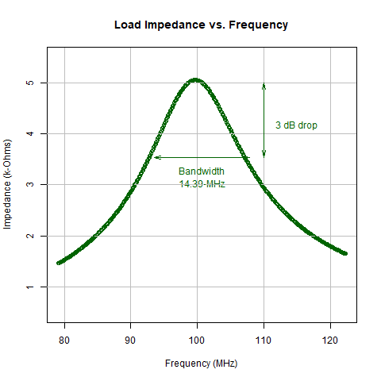
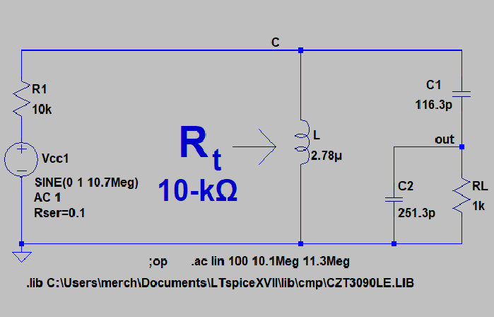
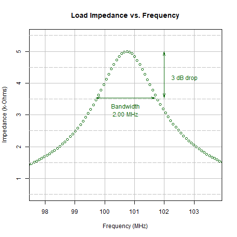

<script type="text/x-mathjax-config">
  MathJax.Hub.Config({ TeX: { equationNumbers: {autoNumber: "all"} } });
</script>

```{r getstylefile, echo=FALSE}

# options(rstudio.markdownToHTML = 
#   function(inputFile, outputFile) {      
#     require(markdown)
#     markdownToHTML(inputFile, outputFile, stylesheet='custom.css')   
#   }
# ) 


# require(knitr) 
# options(markdown.HTML.stylesheet = "custom.css")
# knit2html("index.Rmd", output = "index.html") 

options(warn=-1)

```

<style> 

/* The style sheet file for slidify is in a subdirectory: */
/*    "./libraries/frameworks/io2012/css/slidify.css"                         */

custsty {
  /*background-image:url(C:/path/mypng.png);*/ 
  background-repeat: no-repeat;
  background-position: center center;
  background-size: cover;
}

.boxText {
     font-size:0.9em;

}
    
table {
    border-collapse: collapse;
    width: 980px;
    height: 400px;
    /*background-color: #9999FF;*/
    background-image: none;
    cell-spacing: 0px;
    /*padding-left: 0px;*/
    /*padding-right: 75px;*/
    padding-top: 0px;
    padding-bottom: 0px;
    border: 0px solid #BBBBFF;
    background-color: #CCEEFF;
    margin: auto;
}

th {
    font-color:#FF0000;
    padding-left: 0px;
    /*padding-right: 0px;*/
    padding-top: 0px;
    padding-bottom: 0px;
    background-color: #CCEEFF;
    cell-spacing: 0px;
    border: 0px solid #FFFFFF;
    margin: auto;
    width: 480px;
    height: 20px;
}

td {
    /*padding-left: 0px;*/
    /*padding-right: 0px;*/
    padding-top: 0px;
    padding-bottom: 0px;
    cell-spacing: 0px;
    border: 0px solid #000000;
    margin: auto;
    font-family: arial, verdana, sans-serif;
    background-color: #CCEEFF;
    
    /*width: 480px;*/
    height: 20px;
}

tr {
    margin: auto;
}

body {
  background-color: #EEEEEE;
}

slide:not(.segue)  h2{
 font-family: "Open Sans Condensed";
 font-weight: 700;
 color: #449944;
 /*background-color: #00FFFF; background of S3 */
}

h3 {
    font-family: arial;
    font-weight: normal;
    font-size:36px;
    LINE-HEIGHT:54px;
    color: #449944;
    padding-top: 10px;
    padding-bottom: 4px;

}

h4 {
    font-family: arial;
    font-weight: normal;
    font-size:28px;
    LINE-HEIGHT:42px;
    color: #202020;
    padding-top: 6px;
    padding-bottom: 3px;
}

h5 {
    font-family: arial;
    font-weight: normal;
    font-size:24px;
    LINE-HEIGHT:36px;
    color: #202020;
    padding-top: 5px;
    padding-bottom: 3px;
}

h6 {
    font-family: arial;
    font-weight: 200;
    font-size:18px;
    LINE-HEIGHT:28px;
    color: #202020;
    padding-top: 3px;
    padding-bottom: 2px;
}

.list-line-1 {
    LINE-HEIGHT:20px;
    padding-top: 15px;
    padding-bottom: 10px;
    color: #101010;
}

.list-line-middle {
    LINE-HEIGHT:20px;
    padding-top: 10px;
    padding-bottom: 10px;
    color: #101010;
}

.list-line-last {
    LINE-HEIGHT:20px;
    padding-top: 10px;
    padding-bottom: 10px;
    color: #101010;
}

.booktitle {
    LINE-HEIGHT:20px;
    padding-top: 15px;
    padding-bottom: 10px;
    color: #101010;
    font-style: italic;
}

.columntitle {
    font-size:16px;
    LINE-HEIGHT:20px;
    padding-top: 5px;
    padding-bottom: 2px;
    text-align: center;
    color: #101010;
    }

p {
    padding-left:10px;
    font-family: arial, verdana, sans-serif;
    font-size:14px;
    color: #11FF11;
    font-weight: normal;
}

.tablenote{
    padding-top: 15px;
    font-size:20px;
}

.psmall {
    padding-left:10px;
    font-family: arial, verdana, sans-serif;
    font-size:14px;
    color: #11FF11;
}

img {
    display: block;
    /*padding-left: 0px;*/
    /*padding-right: 0px;*/
    padding-top: 0px;
    padding-bottom: 0px;
    margin-left: auto;
    margin-right: auto;
}

.img {
    /*padding-left: 0px;*/
    /*padding-right: 0px;*/
    padding-top: 0px;
    padding-bottom: 0px;
    border: 0px solid #00FFFF;
    margin: auto;
}

caption{
    padding-bottom: 8px;
    font-size: 0.5em;
}
sub, sup {
 font-size: 75%;
 line-height: 0;
 position: relative;
 vertical-align: baseline;
}

.logga img {
    width: 70%;
    height: auto;
}

.title-slide hgroup > h1 {
  color: #111111;  /* #537E43 #EF5150*/  /*#535E43*/
}

.title-slide hgroup > h2 {
  color: #110000 ;  /* #537E43 #EF5150*/  /*#535E43*/
}

.title-slide hgroup > p {
  font-family: 'Open Sans','Helvetica', 'Crimson Text', 'Garamond',  'Palatino', sans-serif;
  text-align: justify;
  font-size:22px;
  line-height: 1.5em;
  padding-left:10px;
  color: #111111;
}

.title-slide {
  background-color: #CBE7B5 /*#CBE7A5; #EDE0CF; ; #CA9F9D*/
  /* background-image:url(http://goo.gl/EpXln); */
  
  /* Reduce Space between Title and Body */
slides > slide  {
  margin-top: 15px;
  background-color: #00FFFF;
  color: #00FFFF;
}
}

</style>


```{r functions, echo=FALSE}

library(xtable)
library(gridExtra)
library(ggplot2)

## Convert decibels to multiplier
gain_absolute_from_decibels <- function(x){
    10^(x/10)
}

# <p class="boxText">BW<sub>rf</sub>: Bandwidth of RF filter</p>

nf_absolute_from_decibels <- function(x){
    10^(x/10)
}

```

### The Matching Problem

#### The output impedance of a transistor or power amplifier is high compared to a typical antenna. If a 300-$\Omega$ or less antenna were connected directly to a power amplifier with an output impedance of 10-k$\Omega$, nearly all of the power would be self-absorbed by the amplifier because the antenna is practically a short circuit in comparison. Instead, we seek to transfer maximum power to the antenna and reduce the internal power dissipation of the amplifier. The solution to this problem is placing an impedance transformer between the two unmatched components.

#### To generalize the method, the amplifier is a modeled a source with output resistance $R_t$ and the antenna is modeled as a load resistor $RL$.

---

### Discrete Components or Transmission Line

#### An impedance transformer can be implemented either with discrete components or as a transmission line.  The choice is based on the cost and size of the solution. Usually low frequency circuits use discrete components while the transmission line is more favorable at higher RF and microwave frequencies. In this slideshow, we show how to implement the circuit with discrete components and will describe how to accomplish the same thing with transmission lines using the Smith Chart in another slideshow. 

---

### Reproducible Report

#### This slideshow is also an engineering tool. It is produced by a computer script program. Nothing is performed manually as all calulations are performed in code blocks that are mostly hidden. You can spot visible code blocks by rectangular bounded blocks like this one.

```{r pi}
pi

```

#### Sentences like this one are also part of the script but are outside of "code" blocks. This kind of report is called a "reproducible" as the slideshow is not to be altered. Any changes are made to the script program.

---

### Discrete Component Implementation

#### An impedance transformer is a tuned circuit that performs its function at the frequency of the RF power signal being sent to the antenna. There are different levels of performance:

<html>
<head>
</head>
<body>
    <h4 class="list-line-1">(a) No bandwidth control: coil, capacitor, and resistor</h4>
    <h4 class="list-line-last">(b) Controlled bandwidth: coil, two capacitors, and resistor</h4>
    
</body>
</html>


#### We first implement the circuit without bandwidth control using a parallel resonance circuit. Next we adjust the bandwidth by placing an additional capacitor across the load.

---

## Part A: Transformer with Default Bandwidth

#### This method provides a default bandwidth. We begin with these design parameters. 

<br><br>

#### Tuned Frequency $f_o$ = 20-MHz
#### Source output impedance $R_t$ = 4-k$\Omega$
#### Load impedance $RL$ = 5-$\Omega$

```{r designparameters, echo=FALSE}

fo <- 20 * 10^6
Rt <-  4000
RL <- 5

#fo <- 100.7 * 10^6
#BW <- 2000000
#Rt <-   10000
#RL <-   1000

Q1 <- sqrt(Rt/RL-1)
Q <- Q1

# paste(formatC(fo/10^6, digits = 1, format = "f"), "-MHz", sep="")
# paste(formatC(BW/1000, digits = 1, format = "f"), "-kHz", sep="")

```

---

### Simple Matching Transformer with Default Bandwidth

<html>
<head>
</head>
<body>
    <table>
        <tr>
            <th>RF Small Signal AC Model     </th>
            <th>Amplifier Load Impedance (RL)</th>
        </tr>
        <tr><td width="490px"></td>
            <td width="490px"></td> </tr>
        <tr><td><p>This parallel resonant circuit presents a matching impedance of 4-k$\Omega$ at 20 MHz to the power amplifier. The 5-$\Omega$ resistor is transformed to 4-k$\Omega$ in this manner.</p></td>
          <td><p>The transformed load impedance R<sub>t</sub> has a peak at 20-MHz where it matches the source resistance of 4-k$\Omega$. The bandwidth of 707-kHz is the only one possible for this simple circuit. </p></td></tr>
    </table>
</body>
</html>

---

### Circuit Q

#### We will use a concept called Q which represents the relative circuit bandwidth. Let $f_o$  be the resonant frequency of the amplifier and let $f_1$ and $f_2$ be the upper and lower limits of the tuned bandwidth of the transformer. We set the transmitter frequency to $fo=20$ MHz and define Q as follows:

<html>
<head>
</head>
<body>
    <p>$$Q=\frac {f_o}{f_2-f_1}$$</p>
    <p>$$B=\frac {f_o} {Q}$$</p>
</body>
</html>


#### Q is a ratio of two frequencies without units. Later we will use the angular frequency $\omega = 2 \pi f_o$ 

---

### Part A: Simple Circuit   

#### This method provides a defined bandwidth that cannot be adjusted. We begin with a formula from page 44 of the  textbook we reference at the end of the slideshow. 

$$R_t=(1+Q^2) \cdot R_L$$

---


###  Design Calulations without Bandwidth Adjustment

#### We solve for Q as follows:

##### $$Q= \sqrt {\frac {R_t}{R_L} - 1}$$

#### If the power amplifier has an internal output impedance of 4-k$\Omega$ and a load $R_L$ of 5-$\Omega$, the parallel resonant circuit must transform the 5-$\Omega$ resistance to 4-k$\Omega$. We will design the matching transformer as follows. We calculate Q = 28.3. 

```{r nocontrol2, echo=TRUE}

formatC(sqrt(Rt/RL-1), digits = 1, format = "f")

```

---

### Design Calulations for Unadjusted Bandwidth ... continued

#### The bandwidth is already fixed for this design before any component values have been calculated. We calculate the bandwidth as B = 707-kHz using our concept of Q as follows; the extra factor of 1000 converts the result to kHz. Paste is a string operation that displays the result with the kHz units. 

##### $$B= \frac {f_o}{Q}$$

```{r Bu1, echo=FALSE}

B1 <- fo/Q1
B <- B1

```

```{r bu2, echo=TRUE}

paste(formatC(fo/(Q1*1000), digits = 1, format = "f"), "-kHz", sep="")

```

---

### Determine Capacitor

##### We can calculate the capacitor value using the Q value. $X_C = Q \cdot R_L$.

##### $$C = \frac {1}{\omega \cdot X_C}$$

```{r cu1, echo=FALSE}

xc1 <- Q1 * RL
Xc <- xc1
w <- 2 * pi * fo 
C1 <- 1/ (w * xc1)
C <- C1

```


```{r cu2a, echo=TRUE}
## branch impedance X_c:
paste(formatC(Q * RL, digits = 1, format = "f"), "-Ohms", sep="")

## branch capacitance C:
paste(formatC((1/ (w * Xc)) * 10^12, digits = 1, format = "f"), "-pF", sep="")

```

---

### Determine Inductor

###### $$X_L= (\frac {1}{Q^2} + 1 ) \cdot X_C$$

###### $$L= \frac {1}{\omega \cdot X_C}$$

```{r lu1, echo=FALSE}

# xl1 <- (1/Q^2 + 1) * xc1
# XL <- xl1
XL <- Rt/Q

a <- 1
b <- 0-1/(C*w^2) 
c <- (RL^2)/(w^2) 

## $$ L =  \frac{-b + \sqrt{b^2-4ac}}{2a}$$

# Lr <-  (-b + sqrt((b^2)-4*a*c))/2
# L <- RL * C * Rt
L <- XL / w

#L <-  xl1/w

## Branch inductance L:
## paste(formatC(Lr * 10^6, digits = 3, format = "f"), "-uH", sep="")

```

```{r lu2a, echo=TRUE}

## Branch inductance L:
paste(formatC(( Rt/(Q * w)) * 10^6 , digits = 3, format = "f"), "-uH", sep="")

```


```{r ltspice1, echo=FALSE}

bwmhz <- B / 10^6
fomhz <- fo / 10^6
f1 <- floor(10*(fomhz - 1.5* bwmhz))/10
diff <- fomhz - f1 
f2 <- fomhz + diff 
droparrow <- fomhz + 1.3 * bwmhz/2
droptext <- fomhz + 2 * bwmhz/2

lines <- c()
lines[1] <- paste(" * ","C:/Users/merch/OneDrive/Documents/LTSpice/RF/impedanceTransformers/imp_transfx/RF_impedance_Transformer_NoBW.asc",sep="")
lines[2] <- paste("L_RFC c 0 ", L," Ipk=12 Rser=0.0 Cpar=0",sep="")
lines[3] <- paste("C1 c out ", C1, " V=2.5K Irms=0 Rser=0 Lser=0",sep="")
lines[4] <- paste( "RL out 0 ", RL,sep="")
lines[5] <- paste("Rt N01 c ", Rt)
# "Vcc N01 0 SINE(0 10 12Meg) AC 1 Rser=0"
lines[6] <- paste("Vcc N01 0 SINE(0", f1, f2, "Meg) AC 1 Rser=0", sep="")
lines[7] <- ";op"
#lines[8] <- ".ac lin 100 10Meg 12Meg"
lines[8] <- paste(".ac lin 500 ", f1,"Meg"," ", f2, "Meg", sep="")
lines[9] <- ".backanno"
lines[10] <- ".end"
lines[12] <- ""
lines[13] <- ""

```

---

### Netlist

```{r ltspice2, echo=FALSE}

con <- file("imp_transfx/rf_impedance_transformer_noBW.net")
writeLines(lines, con)
close(con)

pcon <- file("imp_transfx/rf_impedance_transformer_noBW.net")
readLines(pcon, skipNul = TRUE) #, encoding="UTF-16"))
close(pcon)

system2("cmd", args = c("/c", "xviix64.exe -ascii -b imp_transfx/rf_impedance_transformer_noBW.net"))
Sys.sleep(5)

```


```{r ltspice3, echo=FALSE}

con <- file("imp_transfx/rf_impedance_transformer_noBW.raw", "r", blocking = FALSE)
lins <- readLines(con, skipNul = TRUE) 
close(con)
len <- length(lins)-19
lenlins <- len + 19
vec <- lins[20:lenlins]

re <-              unlist(lapply(vec, function(x) strsplit(x,",")[[1]][1]))
imag <- as.numeric(unlist(lapply(vec, function(x) strsplit(x,",")[[1]][2])))
patternre <- "([0-9.]+e[+-][0-9]{3})$" 
real <- as.numeric(unlist(lapply(re, function(e) regmatches(e, regexec(patternre, e))[[1]][1])))
remainder <- c(1:len)%%9


phase <- atan2(imag, real)
magnitude <- ((real^2)+imag^2)^0.5
dat <- data.frame(remainder,real,imag,magnitude,phase)
colnames(dat) <- c("remainder","real","imag","Magnitude","Phase")
freq <- dat[dat[,"remainder"]==1,"real"]
is <-   dat[dat[,"remainder"]==7,"Magnitude"]
vc <-   dat[dat[,"remainder"]==2,"Magnitude"]
imp <-  vc/is

dfac <- data.frame(freq/10^6, imp/1000)
colnames(dfac) <- c("Frequency","Impedance")


```


```{r rplotnobandwidth, echo=FALSE, include=FALSE}

png(filename = "no_bw_control.png", width = 480, height = 480, units = "px", pointsize = 12,
    bg = "white", res = NA, family = "", restoreConsole = TRUE,
    type = c("windows", "cairo", "cairo-png"))

bwtext <- paste(formatC(bwmhz, digits = 2, format = "f"), "-MHz", sep="")

 plot(freq/10^6, imp/1000,
      xlim = c(f1, f2), ylim = c(Rt/10^4,0.001*Rt*1.1), col="darkgreen",
      xlab="Frequency (MHz)", ylab="Impedance (k-Ohms)",
     title(main="Load Impedance vs. Frequency"),
     panel.first = grid(nx = NULL, ny = NULL, col = "gray", lty = "solid", lwd=1.8))
     text(fomhz, 0.001*Rt*0.62, "Bandwidth", pos = 3, col="darkgreen")
     text(fomhz, 0.001*Rt*0.57, paste(bwtext,sep=""), pos = 3, col="darkgreen")
     text(droptext, 0.001*Rt*0.8, "3 dB drop", pos = 3, col="darkgreen")
     arrows(x0=fomhz-bwmhz/2, y0 = 0.001*Rt*0.707 , x1 = fomhz + bwmhz/2, length = 0.12, angle = 12,
       code = 3, col = "darkgreen", lty = 1, lwd = 1)
     abline(h = seq(0,22,1), v = seq(0,22,0.5), col = "gray", lty = 5, lwd=1)
     #segments(dropline, 0.001 * Rt, dropline, 0.001*Rt/1.414, col = "darkgreen",lwd=1)
     # x0=fomhz+bwmhz/2
     arrows(x0=droparrow, y0 = 0.001*Rt*0.707 , y1 = Rt/1000,
            length = 0.12, angle = 12,
       code = 3, col = "darkgreen", lty = 1, lwd = 1)

dev.off()

```

---

<html>
<head>
</head>
<body>
    <table>
        <tr>
            <th>Impedance Response for simple Circuit with Default Bandwidth</th>
        </tr>
        <tr><td class="img"></td></tr>
        <tr><td><p class="tablenote">The response of the transformer has a peak at 20-MHz where it matches the source resistance of 4-k$\Omega$ for the power amplifier. The 707-kHz bandwidth is the only one possible for this simple circuit.</p></td></tr>
    </table>
</body>
</html>

---

## Part B: Transformer with Designed Bandwidth

#### This method provides a designed bandwidth by means of a tapped resonant circuit. We begin with these design parameters. 

<br><br>

#### Tuned Frequency $f_o$ = 100-MHz
#### Bandwidth BW = 2-MHz 
#### Source output impedance $R_t$ = 10-k$\Omega$
#### Load impedance $RL$ = 1-$k\Omega$

```{r units2a, echo=FALSE}

fo <- 100 * 10^6
BW <- 2000000
Rt <-   10000
RL <-   1000

```

---


<html>
<head>
</head>
<body>
    <table>
        <tr>
            <th>Small Signal Model for 2-MHz Bandwidth at 100-MHz.</th>
        </tr>
        <tr> <td width="800px"></td>                 </tr>
        <tr><td><h5 class="tablenote">Matching transformer</h5></td></tr>
    </table>
</body>
</html>

---

#### Step-1: Circuit Q for Bandwidth Control

###### $$Q_t= \frac {f_o}{BW}$$

```{r qth, echo=FALSE}

Qt <- fo/BW

```

```{r qtp, echo=TRUE}

paste("Qt =", formatC(Qt, digits = 1, format = "f"))

```

###### The tap section contribution to Q is designated as $Q_p$ and is calculated as follows: 
###### $$Q_p= \sqrt{\frac {R_L}{R_t} \cdot (Q_t^2 + 1) -1}$$

```{r qph, echo=FALSE}

Qp <- sqrt((RL/Rt) * (Qt^2 + 1) - 1)

```

```{r qpp, echo=TRUE}

paste("Qp =", formatC(sqrt((RL/Rt) * (Qt^2 + 1) - 1), digits = 2, format = "f"))

```

---

#### Step-2: Calculate Capacitance of C2

###### C2 = $\sqrt{\frac {Q_p}{w \cdot R_L}}$

```{r c2a, echo=FALSE}

w <- 2 * pi * fo
C2 <- Qp/(w * RL)
C2pf <- C2 * 10^12  

```


```{r c2b, echo=TRUE}

paste("C2 = ", formatC((Qp/(w * RL)) * 10^12, digits = 1, format = "f"), "-pF", sep="")

```

---

#### Step-3: Equivalent Series Components across Tap Connnection

#### The parallel tap components C2 and RL are replaced by the series combination of $C_{se}$ and $R_{se}$ respectively.  

##### $$C_{se} = C_2 \cdot (\frac {1}{Q_p^2+1})$$

```{r seccalc, echo=FALSE}

Cse <- C2 * (1/(Qp^2) + 1)


```


```{r secshow, echo=TRUE}

paste("Cse = ", formatC((C2 * (1/(Qp^2) + 1)) * 10^12, digits = 1, format = "f"), "-pF", sep="")

```

---

##### Parallel Tap Component:

##### $$R_{se} = \frac {RL}{Q_p^2+1}$$

```{r sercalc, echo=FALSE}

Rse <- RL/((Qp^2) + 1) 


```


```{r sershow, echo=TRUE}

paste("Rse = ", formatC(RL/((Qp^2) + 1), digits = 1, format = "f"), "-Ohms", sep="")

```

---

##### Branch Impedance $X_C$:

##### $$X_C = Q_t \cdot R_{se}$$

```{r xcalc, echo=FALSE}

XC <- Qt * Rse
C <- 1 / (w * XC) 

```


```{r xcshow, echo=TRUE}
paste("XC = ", formatC(XC, digits = 1, format = "f"), "-Ohms", sep="")
paste("C = ", formatC((1/(w*XC)) * 10^12, digits = 1, format = "f"), "-pF", sep="")

```

---

##### Circuit Component C1:

##### $$C1= \frac {-C \cdot C_{se}}{C - Cse}$$

```{r c1calc, echo=FALSE}

C1 <- -Cse * C / (C - Cse) 

```


```{r c1show, echo=TRUE}

paste("C1 = ", formatC((-Cse * C / (C - Cse)) * 10^12, digits = 1, format = "f"), "-pF", sep="")

```

---

### Determine Inductor

###### $$w^2= \frac{1}{L \cdot C} - \frac{R^2}{L^2}$$

###### Solve this quadratic for L at resonant frequency $w$

```{r indcalc, echo=FALSE}

a <- 1
b <- 0-1/(C*w^2) 
c <- (Rse^2)/(w^2) 

## $$ L =  \frac{-b + \sqrt{b^2-4ac}}{2a}$$

L <-  (-b + sqrt((b^2)-4*a*c))/2
L2 <- (-b - sqrt((b^2)-4*a*c))/2


```

```{r indshow, echo=TRUE}

paste(formatC(L * 10^6, digits = 2, format = "f"), "-uH", sep="")

```

###### The quadratic equation has a second solution for L. We choose the higher value.

```{r ltspice1101, echo=FALSE}

bwmhz <- BW / 10^6
fomhz <- fo / 10^6
f1 <- floor(10*(fomhz - 1.5* bwmhz))/10
diff <- fomhz - f1 
f2 <- fomhz + diff 

lines <- c()
lines[1] <- paste(" * ","C:/Users/merch/OneDrive/Documents/LTSpice/RF/impedanceTransformers/imp_transfx/bw_control.asc",sep=" ")
lines[2] <- paste("L C 0", L, "Ipk=120 Rser=0.0 Cpar=0", sep=" ")
lines[3] <- paste("Vcc N01 0 SINE(0 ", f1, f2, "Meg) AC 1 Rser=0", sep="")
lines[4] <- paste("Rt N01 C ", Rt)
lines[5] <- paste("C1 C out", C1, sep=" ")
lines[6] <- paste( "RL out 0 ", RL,sep="")
lines[7] <- paste("C2 out 0", C2, sep=" ")
# lines[3] <- paste("C1 c out ", C1, " V=2.5K Irms=0 Rser=0 Lser=0",sep="")
lines[8] <- ";op"
lines[9] <- paste(".ac lin 500 ", f1,"Meg"," ", f2, "Meg", sep="") # ".ac lin 100 10.1Meg 11.3Meg"
lines[10] <- ".backanno"
lines[11] <- ".end"
lines[12] <- ""
lines[13] <- ""
lines[14] <- ""
lines[15] <- ""

```

---

### Netlist

```{r ltspice2101, echo=FALSE}

con <- file("imp_transfx/bw_control.net")
writeLines(lines, con)
close(con)

pcon <- file("imp_transfx/bw_control.net")
readLines(pcon, skipNul = TRUE) 
close(pcon)

system2("cmd", args = c("/c", "xviix64.exe -ascii -b imp_transfx/bw_control.net"))
Sys.sleep(5)

```

```{r ltspice3101, echo=FALSE}

con <- file("imp_transfx/bw_control.raw", "r", blocking = FALSE)
lins <- readLines(con, skipNul = TRUE) #, encoding="UTF-8", skipNul = TRUE) #UCS-2LE") # UTF-16LE
close(con)
len <- length(lins)-20
lenlins <- len + 20
vec <- lins[21:lenlins]

re <-              unlist(lapply(vec, function(x) strsplit(x,",")[[1]][1]))
imag <- as.numeric(unlist(lapply(vec, function(x) strsplit(x,",")[[1]][2])))
patternre <- "([0-9.]+e[+-][0-9]{3})$" 
real <- as.numeric(unlist(lapply(re, function(e) regmatches(e, regexec(patternre, e))[[1]][1])))
remainder <- c(1:len)%%10

phase <- atan2(imag, real)
magnitude <- ((real^2)+imag^2)^0.5
dat <- data.frame(remainder,real,imag,magnitude,phase)
colnames(dat) <- c("remainder","real","imag","Magnitude","Phase")

## The first row has remainder of 1.
## The last row of the first group has a remainder of 0.
freq <- dat[dat[,"remainder"]==1,"real"]
vc <-   dat[dat[,"remainder"]==2,"Magnitude"]
iC1 <-  dat[dat[,"remainder"]==5,"Magnitude"]
iR1 <-  dat[dat[,"remainder"]==9,"Magnitude"]
iL <-   dat[dat[,"remainder"]==7,"Magnitude"]
imp <- vc/iR1
#imp <- vc/(iL+iC1)

dfac <- data.frame(freq/10^6, imp,vc,iC1,iL)
colnames(dfac) <- c("Frequency","Impedance","Voltage","LegCurrent","InductorCurrent")
# print(dfac)
bwmhz <- BW / 10^6
fomhz <- fo / 10^6
f1 <- floor(10*(fomhz - 1.5* bwmhz))/10
diff <- fomhz - f1 
f2 <- fomhz + diff # ceiling(10*(fomhz + 1.5 * bwmhz))/10

droparrow <- fomhz + 1.3 * bwmhz/2
droptext <- fomhz + 2 * bwmhz/2

```

```{r rplot101, echo=FALSE, include=FALSE}

png(filename = "bw_control.png", width = 480, height = 480, units = "px", pointsize = 12,
    bg = "white", res = NA, family = "", restoreConsole = TRUE,
    type = c("windows", "cairo", "cairo-png"))

bwtext <- paste(formatC(bwmhz, digits = 2, format = "f"), "-MHz", sep="")

 plot(freq/10^6, imp/1000,
      #xlim = c(f1, f2),
      #lim = c(Rt/10^4,0.001*Rt*1.1), col="darkgreen",
      xlab="Frequency (MHz)", ylab="Impedance (k-Ohms)",
     title(main="Load Impedance vs. Frequency"),
     panel.first = grid(nx = NULL, ny = NULL, col = "gray", lty = "solid", lwd=1.8))
     text(fomhz, 0.001*Rt*0.62, "Bandwidth", pos = 3, col="darkgreen")
     text(fomhz, 0.001*Rt*0.57, paste(bwtext,sep=""), pos = 3, col="darkgreen")
     text(droptext, 0.001*Rt*0.8, "3 dB drop", pos = 3, col="darkgreen")
     arrows(x0=fomhz-bwmhz/2, y0 = 0.001*Rt*0.707 , x1 = fomhz + bwmhz/2, length = 0.12, angle = 12,
       code = 3, col = "darkgreen", lty = 1, lwd = 1)
     abline(h = seq(0,22,0.5), v = seq(0,22,0.1), col = "gray", lty = 5, lwd=1)
     #segments(dropline, 0.001 * Rt, dropline, 0.001*Rt/1.414, col = "darkgreen",lwd=1)
     # x0=fomhz+bwmhz/2
     arrows(x0=droparrow, y0 = 0.001*Rt*0.707 , y1 = Rt/1000, 
            length = 0.12, angle = 12,
       code = 3, col = "darkgreen", lty = 1, lwd = 1)

dev.off()


```

---

<html>
<head>
</head>
<body>
    <table>
        <tr>
            <th>Impedance Response for 2-MHz Bandwidth Circuit</th>
        </tr>
        <tr><td class="img" width="600px"></td></tr>
        <tr><td><h5 class="tablenote">The response of the transformer has a peak at 100-MHz where it matches the source resistance of 10-k$\Omega$ for the power amplifier.</h5></td></tr>
    </table>
</body>
</html>


---

<html>
<head>
</head>
<body>
    <h2> References</h2>
    <br></br>
    <h4> This slide show implements the method described in the following book:</h4>
    <br></br>
    <h4 class="booktitle">Solid State Radio Engineering</h4>
    <h4 class="list-line-middle">Herbert L. Krauss, Charles W. Bostian, Frederick H. Raab</h4>
    <h4 class="list-line-last">John Wiley & Sons Inc.; 1980 </h4>
    
</body>
</html>

<br></br>
#### Marcel Merchat
#### August 22, 2017

